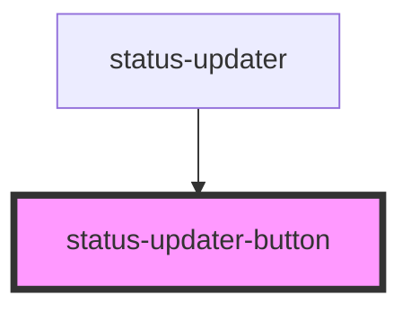

# status-updater-button

<!-- Auto Generated Below -->

## Properties

| Property               | Attribute               | Description | Type      | Default     |
| ---------------------- | ----------------------- | ----------- | --------- | ----------- |
| `availableOptions`     | `available-options`     |             | `string`  | `'[]'`      |
| `buttonsCssClass`      | `buttons-css-class`     |             | `string`  | `''`        |
| `color`                | `color`                 |             | `string`  | `'primary'` |
| `disabled`             | `disabled`              |             | `boolean` | `false`     |
| `expand`               | `expand`                |             | `string`  | `'full'`    |
| `fill`                 | `fill`                  |             | `string`  | `'solid'`   |
| `individualProperties` | `individual-properties` |             | `string`  | `'{}'`      |
| `popupOptions`         | `popup-options`         |             | `string`  | `'{}'`      |
| `shape`                | `shape`                 |             | `string`  | `undefined` |
| `showAddDetail`        | `show-add-detail`       |             | `boolean` | `true`      |
| `size`                 | `size`                  |             | `string`  | `'default'` |
| `strong`               | `strong`                |             | `boolean` | `false`     |

## Events

| Event                | Description | Type               |
| -------------------- | ----------- | ------------------ |
| `clickUpdaterButton` |             | `CustomEvent<any>` |

## Dependencies

### Used by

 - [status-updater](../status-updater)

### Graph

----------------------------------------------

*Built with [StencilJS](https://stenciljs.com/)*
