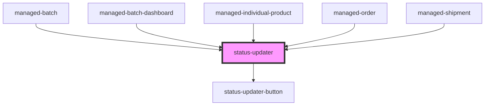

# status-updater

<!-- Auto Generated Below -->

## Properties

| Property         | Attribute          | Description | Type     | Default                     |
| ---------------- | ------------------ | ----------- | -------- | --------------------------- |
| `currentState`   | `current-state`    |             | `string` | `undefined`                 |
| `currentString`  | `current-string`   |             | `string` | `"Current Status:"`         |
| `noUpdateString` | `no-update-string` |             | `string` | `"No operations available"` |
| `pastString`     | `past-string`      |             | `string` | `"Past Status:"`            |
| `statesJSON`     | `state-json`       |             | `any`    | `undefined`                 |
| `updateString`   | `update-string`    |             | `string` | `"Available Operation:"`    |

## Events

| Event               | Description                                 | Type               |
| ------------------- | ------------------------------------------- | ------------------ |
| `statusUpdateEvent` | Through this event action requests are made | `CustomEvent<any>` |

## Dependencies

### Used by

 - [managed-batch](../managed-batch)
 - [managed-batch-dashboard](../managed-batch-dashboard)
 - [managed-individual-product](../managed-individual-product)
 - [managed-order](../managed-order)
 - [managed-shipment](../managed-shipment)

### Depends on

- [status-updater-button](../status-updater-button)

### Graph

----------------------------------------------

*Built with [StencilJS](https://stenciljs.com/)*
