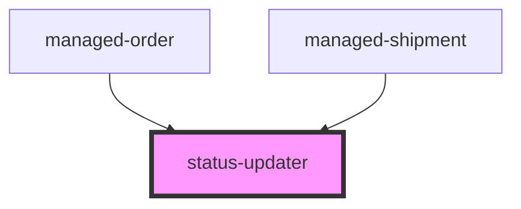

# status-updater

<!-- Auto Generated Below -->

## Properties

| Property       | Attribute       | Description | Type     | Default     |
| -------------- | --------------- | ----------- | -------- | ----------- |
| `currentState` | `current-state` |             | `string` | `undefined` |
| `statesJSON`   | `state-json`    |             | `string` | `undefined` |

## Events

| Event               | Description                                 | Type                  |
| ------------------- | ------------------------------------------- | --------------------- |
| `statusUpdateEvent` | Through this event action requests are made | `CustomEvent<string>` |

## Dependencies

### Used by

 - [managed-order](../managed-order)
 - [managed-shipment](../managed-shipment)

### Graph

----------------------------------------------

*Built with [StencilJS](https://stenciljs.com/)*
