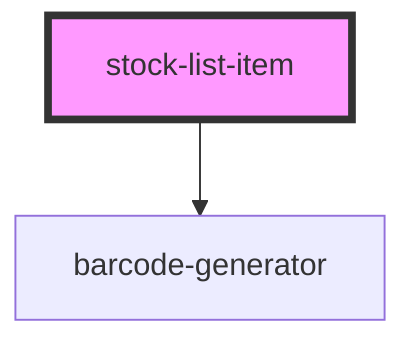

# stock-list-item

<!-- Auto Generated Below -->

## Events

| Event                   | Description                                                                                                                | Type               |
| ----------------------- | -------------------------------------------------------------------------------------------------------------------------- | ------------------ |
| `webcardinal:model:get` | Through this event model is received (from webc-container, webc-for, webc-if or any component that supports a controller). | `CustomEvent<any>` |

## Dependencies

### Depends on

- [barcode-generator](../barcode-generator)

### Graph

----------------------------------------------

*Built with [StencilJS](https://stenciljs.com/)*
