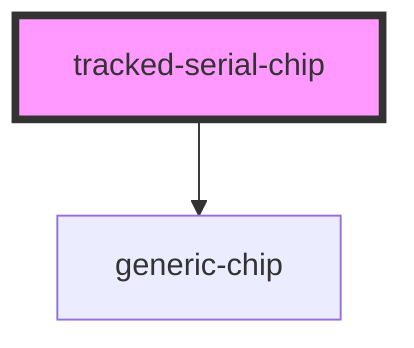

# tracked-serial-chip

<!-- Auto Generated Below -->

## Properties

| Property    | Attribute   | Description | Type      | Default       |
| ----------- | ----------- | ----------- | --------- | ------------- |
| `color`     | `color`     |             | `string`  | `"secondary"` |
| `outline`   | `outline`   |             | `boolean` | `true`        |
| `reference` | `reference` |             | `string`  | `undefined`   |

## Events

| Event               | Description                                   | Type               |
| ------------------- | --------------------------------------------- | ------------------ |
| `fgt-track-request` | Through this event tracking requests are made | `CustomEvent<any>` |

## Dependencies

### Depends on

- [generic-chip](../generic-chip)

### Graph

----------------------------------------------

*Built with [StencilJS](https://stenciljs.com/)*
