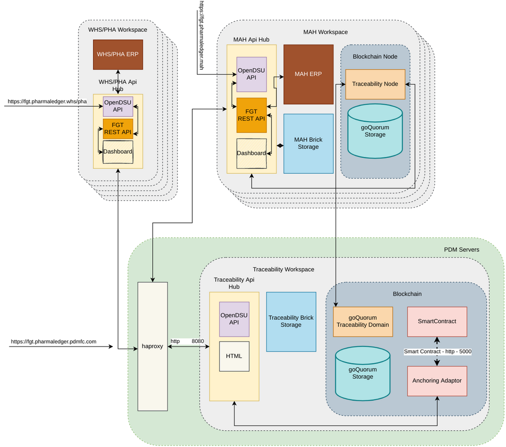
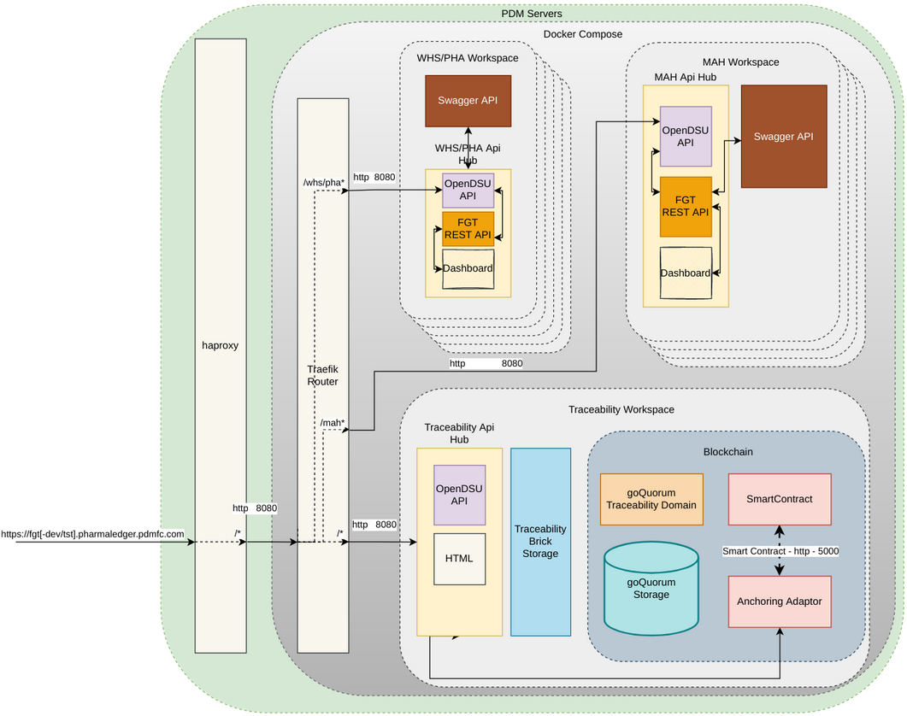

### API

#### Deployment Diagram

##### Real World Scenario

The proposed REST Api deployment diagram is as follows



where each participant has its own environment, running it's own:
 - ERP System;
 - OpenDSU API (ApiHub);
 - FGT REST API;
 - (optional, typically for MAHs) blockchain node;

##### Testing Scenario

Because the above infrastructure is not testable at this moment, we propose to deploy the following on our servers:



where each participant has its own environment, running it's own:
- Swagger Instance (mocks the ERP System);
- OpenDSU API (ApiHub);
- FGT REST API;

**How to deploy**

ssh into the machine;
clone the workspace;
go to ```fgt-workspace/docker/api```
run ```./bootCompose.sh ${env}``` where env can be nothing (localhost), dev (fgt-dev.pharmaledger.pdmfc.com) or anything else (fgt.pharmaledger.pdmfc.com)

